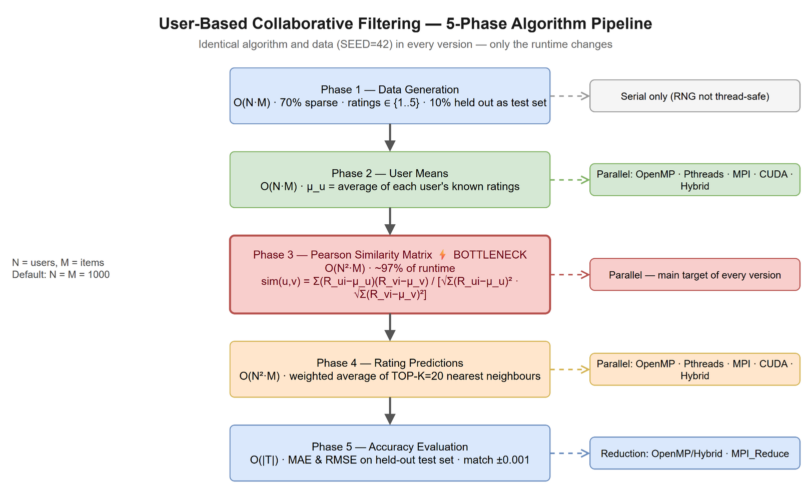
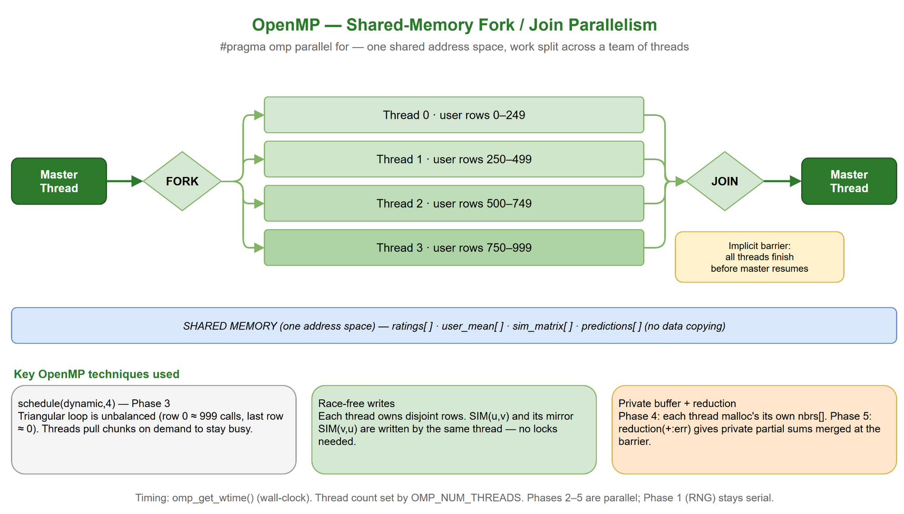
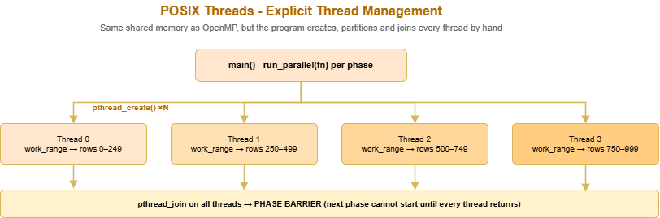
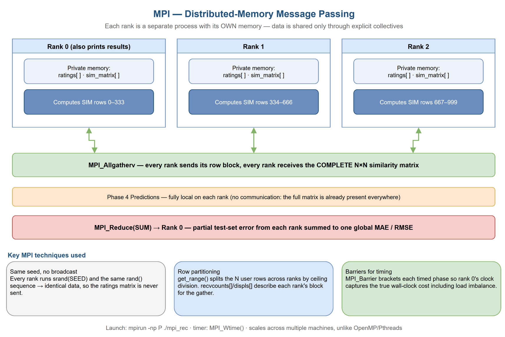
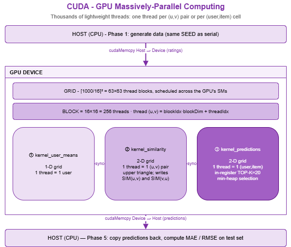
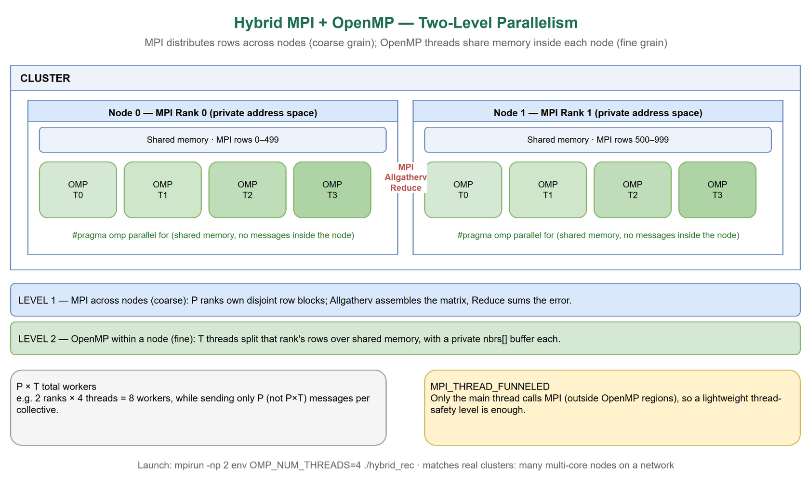

# Analysis Report
## EC7207: High Performance Computing
## Parallel Pearson Correlation Based Recommendation System

**Group Number: 11**
- EG/2021/4417 — Ashfaq M.R.M.
- EG/2021/4419 — Athanayaka K.A.L.G.
- EG/2021/4424 — Balasooriya J.M.

**Technologies:** Serial (C) · OpenMP · POSIX Threads · MPI · CUDA · Hybrid MPI+OpenMP  
**Problem size:** 1,000 users × 1,000 items · SEED=42 · Sparsity=70% · TOP-K=20  
**Platform:** Pop!_OS 24.04 LTS · GCC 13.3.0 · Open MPI 4.1.6 · CUDA 12.0 · Intel Core i7-11800H (8 physical / 16 logical cores) · NVIDIA GeForce RTX 3050 Laptop GPU (16 SMs, compute capability 8.6)

---

## Table of Contents
1. [Introduction](#1-introduction)
2. [Algorithm Design and Parallel Programming Concepts](#2-algorithm-design-and-parallel-programming-concepts)
3. [Accuracy Analysis — Parallel vs. Serial](#3-accuracy-analysis--parallel-vs-serial)
4. [Timing Measurements and Performance Analysis](#4-timing-measurements-and-performance-analysis)
5. [Performance Discussion](#5-performance-discussion)
6. [Conclusions](#6-conclusions)

---

## 1. Introduction

Modern collaborative filtering recommendation systems compute pairwise user similarity over large rating matrices. As the number of users grows, the O(N² × M) similarity computation becomes the dominant bottleneck — for N = M = 1,000 this equates to approximately 500 million floating-point operations.

This report documents the design, implementation, and performance evaluation of a **Pearson Correlation-Based Collaborative Filtering Recommender System** parallelised using five HPC technologies: OpenMP, POSIX Threads (Pthreads), MPI, CUDA, and a Hybrid MPI+OpenMP approach.

All measurements were obtained on a single laptop-class machine: an **Intel Core i7-11800H** (8 physical / 16 logical cores) with an **NVIDIA GeForce RTX 3050 Laptop GPU** (16 SMs, compute capability 8.6), running Pop!_OS 24.04 LTS with GCC 13.3.0, Open MPI 4.1.6, and CUDA 12.0. CPU runs sweep 1, 2, 4, and 8 workers; CUDA runs on the GPU.

### Experimental Configuration

| Parameter           | Value                    |
|---------------------|--------------------------|
| Users (N)           | 1,000                    |
| Items (M)           | 1,000                    |
| Sparsity            | 70%                      |
| Test split          | 10%                      |
| Test set size       | 29,866 ratings           |
| TOP-K neighbours    | 20                       |
| Random seed         | 42                       |
| Benchmark threads   | 1, 2, 4, 8               |
| Timing method       | Wall-clock (CLOCK_MONOTONIC / omp_get_wtime / MPI_Wtime) |

---

## 2. Algorithm Design and Parallel Programming Concepts

### 2.1 Algorithm Pipeline (5 Phases)



*Figure 1: The five-phase pipeline shared by every implementation. Identical algorithm and data (SEED=42) — only the runtime changes. Phase 3 is the O(N²·M) bottleneck.*

The system executes in five sequential phases. Phase 4 (prediction) dominates at ~84% of serial runtime; Phase 3 (similarity) accounts for ~16%.

| Phase | Name              | Description                                                | Complexity      |
|-------|-------------------|------------------------------------------------------------|-----------------|
| 1     | Data Generation   | Synthetic sparse rating matrix; 10% test split             | O(N × M)        |
| 2     | User Means        | Per-user mean rating μ_u                                   | O(N × M)        |
| 3     | **Similarity**    | Pearson correlation for all (u,v) pairs — **bottleneck**   | O(N² × M)       |
| 4     | **Predictions**   | TOP-K weighted prediction for unrated (user, item) pairs   | O(N² × M)       |
| 5     | MAE Evaluation    | Error on held-out test set                                 | O(|T|)          |

**Pearson correlation formula (Phase 3):**

```
           Σᵢ (Rᵤᵢ − μᵤ)(Rᵥᵢ − μᵥ)
sim(u,v) = ─────────────────────────────────────
           √[Σᵢ (Rᵤᵢ−μᵤ)²] × √[Σᵢ (Rᵥᵢ−μᵥ)²]
```

With N = 1,000: 499,500 unique Pearson pair computations, each scanning up to M = 1,000 items.

**Prediction formula (Phase 4):**

```
                   Σₖ [sim(u,k) × (Rₖᵢ − μₖ)]
pred(u,i) = μᵤ + ────────────────────────────────
                          Σₖ sim(u,k)
```

where k ranges over TOP-K most similar neighbours who have rated item i.

Both phases are embarrassingly parallel at the row level — each user's computation is independent — making them ideal targets for all five parallelisation strategies.

---

### 2.2 OpenMP — Shared-Memory Fork-Join Parallelism



*Figure 2: OpenMP fork/join model — the master thread forks a team of threads over shared memory, then joins at an implicit barrier.*

**Concept:** OpenMP exploits shared-memory parallelism using compiler directives. A single master thread forks into T worker threads, all sharing the same process address space, then joins back at an implicit barrier.

**Phase 3 (Similarity bottleneck):**
The outer loop over user pairs is distributed with `#pragma omp parallel for schedule(dynamic, 4)`. **Dynamic scheduling** was specifically chosen because the triangular loop creates severe load imbalance: thread 0 processes N−1 = 999 Pearson calls, while the last thread processes just a few. Dynamic scheduling lets idle threads pull new 4-row chunks from a shared work queue.

**Race-freedom:** Each thread owns a contiguous set of outer loop values (row index u) and writes only to `SIM(u,v)` and `SIM(v,u)` for its exclusive u values. No two threads write the same matrix cell — no mutex or atomic operations required.

**Phase 4 (Predictions):** Each thread allocates its own private `SimPair *nbrs` buffer on the heap inside the parallel block. This eliminates all shared state during neighbour sorting.

**Phase 5 (MAE):** The `reduction(+:err)` clause gives each thread a private error accumulator; OpenMP automatically sums all copies at the implicit barrier.

---

### 2.3 Pthreads — Manual POSIX Thread Management



*Figure 3: Pthreads create/partition/join cycle, repeated per parallel phase. `pthread_join` is the only synchronisation barrier.*

**Concept:** POSIX Threads provide explicit, low-level manual thread management. Unlike OpenMP (compiler-generated orchestration), Pthreads requires the programmer to explicitly create threads, assign work, and synchronise with `pthread_join`.

**Thread lifecycle pattern:**
A `run_parallel(fn, nthreads)` harness is called at the start of each of Phases 2, 3, and 4:

1. `pthread_create()` — creates T threads, each receiving a `ThreadArgs` struct with its `tid` and `nthreads`.
2. Each thread independently derives its exclusive row range: `start = tid × ⌈N/T⌉`, `end = min(start + ⌈N/T⌉, N)`.
3. `pthread_join()` — the main thread waits for all T threads, acting as a **phase barrier**.

**Key difference from OpenMP:** Threads are created and joined separately for each phase (three `run_parallel` calls). OpenMP reuses threads across phases; Pthreads pays OS thread-creation overhead three times.

**Static vs. dynamic work assignment:** Pthreads uses static ceiling-division row assignment. For the triangular similarity loop this creates load imbalance — thread 0 processes more rows than thread T−1 — which is why Pthreads efficiency (0.87 at 8T) is slightly lower than OpenMP (0.95 at 8T).

---

### 2.4 MPI — Distributed-Memory Parallelism



*Figure 4: MPI ranks as independent processes with private memory. `MPI_Allgatherv` assembles the full matrix; `MPI_Reduce` sums the error to rank 0.*

**Concept:** MPI implements distributed-memory parallelism where each rank is a completely independent process with its own private address space. Data sharing requires explicit message passing.

**Data partitioning (row partitioning):**
The N = 1,000 users are divided evenly across P ranks. Rank r owns rows `[r×(N/P), (r+1)×(N/P))`. With P = 4: Rank 0 owns users 0–249, Rank 1 owns 250–499, etc.

**Phase-by-phase communication strategy:**

| Phase | Strategy                                                         | MPI Primitive        |
|-------|------------------------------------------------------------------|----------------------|
| 1     | All ranks call `srand(42)` → identical data, no communication   | —                    |
| 2     | Each rank computes its slice of `user_mean[]`                    | `MPI_Allgatherv`     |
| 3     | Each rank fills its rows of the N×N similarity matrix           | `MPI_Allgatherv`     |
| 4     | Each rank predicts its own users — no communication needed       | —                    |
| 5     | Each rank computes local error sum                               | `MPI_Reduce(MPI_SUM)`|

**Key overhead:** `MPI_Allgatherv` for the N×N similarity matrix transfers ~4 MB at N = 1,000. This overhead limits efficiency compared to shared-memory models, but scales linearly with P (each rank sends N/P rows and receives N rows).

---

### 2.5 CUDA — GPU Massively Parallel Computing



*Figure 5: CUDA grid/block/thread hierarchy and GPU memory hierarchy. Three sequential kernels run between Host→Device and Device→Host transfers.*

> **Result:** CUDA was benchmarked on an **NVIDIA GeForce RTX 3050 Laptop GPU** (16 SMs, compute capability 8.6). It is the fastest implementation by a wide margin — similarity 0.0862 s, prediction 0.1343 s, total **0.2205 s (≈38× faster than serial)** — while reproducing the identical MAE (1.2574) and similarity checksum (942.387323) as every CPU version.

**Concept:** CUDA exploits the massively parallel architecture of NVIDIA GPUs, launching thousands of threads organised into a two-level grid/block hierarchy.

**Three CUDA kernels:**

| Kernel                  | Launch Config                                      | Assignment                   |
|-------------------------|----------------------------------------------------|------------------------------|
| `kernel_user_means`     | `<<<(N+255)/256, 256>>>`                           | 1 thread = 1 user mean       |
| `kernel_similarity`     | `dim3(⌈N/16⌉, ⌈N/16⌉), dim3(16,16)`              | 1 thread = 1 (u,v) pair      |
| `kernel_predictions`    | 2D grid, users × items                             | 1 thread = 1 (user,item) pair|

For N = 1,000: the similarity kernel launches **63 × 63 × 256 = 1,016,064 threads** simultaneously, covering all 499,500 unique pairs. Timing uses `cudaEventRecord` (GPU-side timestamps) to measure kernel-only time vs. `cudaMemcpy` transfer overhead separately.

**Memory hierarchy:** Per-thread registers hold scalar accumulators and the TOP-K arrays (`top_sim[20]`, `top_rat[20]`). Global GPU DRAM holds the large rating, similarity, and prediction arrays. Shared memory is not used as the algorithm is embarrassingly parallel with no inter-thread data sharing required.

---

### 2.6 Hybrid MPI+OpenMP — Two-Level Parallelism



*Figure 6: Two-level parallelism — MPI distributes rows across nodes (coarse grain); OpenMP threads share memory within each node (fine grain).*

**Concept:** Combines MPI for coarse-grain inter-node distribution and OpenMP for fine-grain intra-node threading, matching modern HPC cluster architecture where each node has multiple cores connected to other nodes via high-speed interconnect.

**Two-level decomposition:**

| Level       | Technology | Scope                     | Example (2×4)                        |
|-------------|------------|---------------------------|--------------------------------------|
| Level 1     | MPI        | Partitions users across nodes/processes | Rank 0: users 0–499, Rank 1: users 500–999 |
| Level 2     | OpenMP     | Sub-divides local users within each rank | Rank 0's 4 threads: rows 0–124, 125–249, 250–374, 375–499 |
| **Total**   | —          | P × T workers             | 2 × 4 = **8 workers**               |

**Thread safety:** `MPI_Init_thread(MPI_THREAD_FUNNELED)` ensures all MPI calls are made exclusively from the main thread. After the OpenMP parallel region completes its implicit barrier, the main thread calls `MPI_Allgatherv` — this satisfies the FUNNELED constraint.

**Two-level reduction (Phase 5):**
- Level 2 (within rank): `reduction(+:local_err)` merges per-thread accumulators.
- Level 1 (across ranks): `MPI_Reduce(MPI_SUM)` sums local errors into Rank 0.

**Four benchmarked configurations (all 8 total workers):**

| Configuration | MPI Ranks (P) | OMP Threads (T) | Characteristic                                    |
|---------------|---------------|-----------------|---------------------------------------------------|
| Hybrid 2×4    | 2             | 4               | Fewer MPI messages; more shared-memory parallelism |
| Hybrid 4×2    | 4             | 2               | Balanced communication vs. threading              |
| Hybrid 8×1    | 8             | 1               | Equivalent to pure MPI (no OpenMP benefit)        |
| Hybrid 1×8    | 1             | 8               | Equivalent to pure OpenMP (with MPI overhead)     |

---

## 3. Accuracy Analysis — Parallel vs. Serial

All parallel implementations are validated against the serial baseline using two accuracy metrics — **Mean Absolute Error (MAE)** and **Root Mean Square Error (RMSE)** — plus a **similarity-matrix checksum**.

**MAE and RMSE formulas:**
```
MAE  = (1 / |T|) × Σ |pred(u,i) − actual(u,i)|
RMSE = √[ (1 / |T|) × Σ (pred(u,i) − actual(u,i))² ]
```
where |T| = 29,866 (number of held-out test entries).

**MAE vs. RMSE.**  
Both are reported. MAE is in the same 1–5 rating units and weighs all errors equally; RMSE squares the errors and so penalises occasional large misses more heavily (RMSE ≥ MAE always). Here MAE = 1.2574 and RMSE = 1.4579 for every CPU version, so the two metrics agree on the accuracy ranking — the parallelisation changes runtime, not prediction quality.

**Correctness verification — Sim-matrix checksum:**  
In addition to MAE, the sum of all N×N similarity matrix values is computed as a checksum. All CPU-based versions must produce an **identical checksum** since they perform the same IEEE 754 arithmetic on the same input data. Any deviation indicates a race condition or partitioning bug.

### MAE Results Table

| Version      | Workers | MAE    | RMSE   | Matches Serial?         | Sim Checksum |
|--------------|---------|--------|--------|-------------------------|--------------|
| Serial       | 1       | 1.2574 | 1.4579 | baseline                | 942.387323   |
| OpenMP       | 1T      | 1.2574 | 1.4579 | ✓ YES (Δ = 0.0000)      | 942.387323   |
| OpenMP       | 2T      | 1.2574 | 1.4579 | ✓ YES (Δ = 0.0000)      | 942.387323   |
| OpenMP       | 4T      | 1.2574 | 1.4579 | ✓ YES (Δ = 0.0000)      | 942.387323   |
| OpenMP       | 8T      | 1.2574 | 1.4579 | ✓ YES (Δ = 0.0000)      | 942.387323   |
| Pthreads     | 1T      | 1.2574 | 1.4579 | ✓ YES (Δ = 0.0000)      | 942.387323   |
| Pthreads     | 2T      | 1.2574 | 1.4579 | ✓ YES (Δ = 0.0000)      | 942.387323   |
| Pthreads     | 4T      | 1.2574 | 1.4579 | ✓ YES (Δ = 0.0000)      | 942.387323   |
| Pthreads     | 8T      | 1.2574 | 1.4579 | ✓ YES (Δ = 0.0000)      | 942.387323   |
| MPI          | 1P      | 1.2574 | 1.4579 | ✓ YES (Δ = 0.0000)      | 942.387323   |
| MPI          | 2P      | 1.2574 | 1.4579 | ✓ YES (Δ = 0.0000)      | 942.387323   |
| MPI          | 4P      | 1.2574 | 1.4579 | ✓ YES (Δ = 0.0000)      | 942.387323   |
| MPI          | 8P      | 1.2574 | 1.4579 | ✓ YES (Δ = 0.0000)      | 942.387323   |
| Hybrid 2×4   | 8       | 1.2574 | 1.4579 | ✓ YES (Δ = 0.0000)      | 942.387323   |
| Hybrid 4×2   | 8       | 1.2574 | 1.4579 | ✓ YES (Δ = 0.0000)      | 942.387323   |
| Hybrid 8×1   | 8       | 1.2574 | 1.4579 | ✓ YES (Δ = 0.0000)      | 942.387323   |
| Hybrid 1×8   | 8       | 1.2574 | 1.4579 | ✓ YES (Δ = 0.0000)      | 942.387323   |
| **CUDA**     | **GPU** | **1.2574** | **1.4579** | **✓ YES (Δ = 0.0000)** | **942.387323** |

**Every run — all CPU versions and the CUDA GPU version — produces an MAE of exactly 1.2574, an RMSE of 1.4579, and an identical similarity-matrix checksum of 942.387323.**  
This confirms:
- No race conditions in any parallel version (CPU or GPU)
- Data partitioning and synchronisation are mathematically correct
- Fixed random seed (SEED = 42) ensures every version operates on the same dataset


*Figure 7: MAE correctness across all parallel versions vs. serial baseline. All bars lie within the ±0.001 tolerance band (green shading).*

---

## 4. Timing Measurements and Performance Analysis

### 4.1 Performance Metric Definitions

**Speedup:**
```
S(p) = T_serial / T_parallel(p)
```

**Efficiency:**
```
E(p) = S(p) / p
```
E(p) = 1.0 means perfect linear scaling; E(p) < 1.0 means overhead reduces effectiveness.

**Amdahl's Law (theoretical speedup limit):**
```
S_max = 1 / (f + (1−f)/p)
```
where f is the serial fraction. The *algorithmic* serial fraction here is tiny — only data generation, user means, and evaluation run serially (≈ 0.025 s of an 8.4 s run, f ≈ 0.3%). In practice the achievable speedup is governed by an **effective** serial fraction that also absorbs reduced all-core turbo clocks and memory-bandwidth saturation. Fitting Amdahl to the measured OpenMP-8T speedup (6.32×) gives f_eff ≈ 3.8% (S_max ≈ 26×) — see §5.5.

---

### 4.2 Serial Baseline

| Phase                    | Time (s) |
|--------------------------|----------|
| Data generation          | 0.0220   |
| User mean computation    | 0.0032   |
| **Similarity matrix**    | **1.3549**   |
| **Prediction phase**     | **7.0277**   |
| MAE evaluation           | < 0.001  |
| **Total (sim + pred)**   | **8.3826**   |

> Note: Phase 4 (predictions) dominates at **83.8%** of total time. Phase 3 (similarity) accounts for **16.2%**. The prediction phase is expensive because each unrated (user, item) cell requires an O(N) neighbour scan followed by a sort — applied across all N × M cells.

---

### 4.3 OpenMP — Varying Thread Count

| Threads (T) | Sim (s) | Pred (s) | Total (s) | Speedup S(T) | Efficiency E(T) |
|-------------|---------|----------|-----------|--------------|-----------------|
| 1           | 1.6102  | 7.2447   | 8.8549    | 0.95         | 0.95            |
| 2           | 0.8114  | 3.6679   | 4.4792    | 1.87         | 0.94            |
| 4           | 0.4457  | 2.0704   | 2.5161    | 3.33         | 0.83            |
| **8**       | **0.2369** | **1.0903** | **1.3272** | **6.32** | **0.79**      |

**Best result: ×6.32 speedup at 8 threads, 79% efficiency.**

Speedup relative to serial baseline (8.3826 s). OpenMP 1T is slightly slower than serial due to thread-creation overhead with no actual parallelism benefit. Efficiency tapers from 0.94 (2T) to 0.79 (8T): on a laptop CPU, all-8-core turbo clocks are lower than the single-core boost, and the memory-bound prediction phase contends for shared last-level cache and memory bandwidth as more cores become active.

---

### 4.4 Pthreads — Varying Thread Count

| Threads (T) | Sim (s) | Pred (s) | Total (s) | Speedup S(T) | Efficiency E(T) |
|-------------|---------|----------|-----------|--------------|-----------------|
| 1           | 1.3333  | 7.3272   | 8.6605    | 0.97         | 0.97            |
| 2           | 0.9816  | 3.7720   | 4.7536    | 1.76         | 0.88            |
| 4           | 0.5999  | 2.0688   | 2.6687    | 3.14         | 0.79            |
| **8**       | **0.3519** | **1.1275** | **1.4794** | **5.67** | **0.71**      |

**Best result: ×5.67 speedup at 8 threads, 71% efficiency.**

---

### 4.5 MPI — Varying Process Count

| Processes (P) | Sim (s) | Pred (s) | Total (s) | Speedup S(P) | Efficiency E(P) |
|---------------|---------|----------|-----------|--------------|-----------------|
| 1             | 3.1994  | 7.4317   | 10.6311   | 0.79         | 0.79            |
| 2             | 1.6090  | 3.8648   | 5.4739    | 1.53         | 0.77            |
| 4             | 0.9031  | 2.1281   | 3.0311    | 2.77         | 0.69            |
| **8**         | **0.4846** | **1.1550** | **1.6395** | **5.11** | **0.64**    |

**Best result: ×5.11 speedup at 8 processes, 64% efficiency.**

> MPI 1P (10.63 s) is markedly slower than serial (8.38 s). This is expected — MPI process startup, the `MPI_Allgatherv` of the full N×N similarity matrix even with a single process, and `MPI_Wtime`/barrier overhead all add latency. This is not a bug.

---

### 4.6 Hybrid MPI+OpenMP — Fixed 8 Total Workers

| Configuration | P | T | Sim (s) | Pred (s) | Total (s) | Speedup | Efficiency |
|---------------|---|---|---------|----------|-----------|---------|------------|
| Hybrid 2×4    | 2 | 4 | 1.2032  | 2.7766   | 3.9798    | 2.11    | 0.26       |
| Hybrid 4×2    | 4 | 2 | 0.6169  | 1.1631   | 1.7800    | 4.71    | 0.59       |
| **Hybrid 8×1**| **8** | **1** | **0.5149** | **1.1904** | **1.7053** | **4.92** | **0.61** |
| Hybrid 1×8    | 1 | 8 | 2.4520  | 5.4913   | 7.9433    | 1.06    | 0.13       |

**Best Hybrid result: Hybrid 8×1 — ×4.92 speedup (essentially pure MPI with 8 ranks).**

---

### 4.7 Scalability Across Problem Sizes

The previous tables vary the **number of workers** at a fixed 1,000×1,000 problem. To address the guideline's "...and other parameters" and demonstrate **scalability**, the benchmark is also swept across problem size N = M ∈ {500, 1000, 2000} at a fixed 8 workers. Because the dominant phases are O(N²·M), the serial time grows roughly cubically with N (≈ ×8 per doubling), which lets us check whether each model *sustains* its speedup as the problem grows.

Run `bash results/run_benchmarks.sh` (now sweeps the three sizes) to regenerate `results/speedup_table.csv`; the table below is populated from that output.

| Size (N×M) | Serial (s) | OpenMP 8T → speedup | MPI 8P → speedup | CUDA → speedup |
|------------|-----------|---------------------|------------------|----------------|
| 500×500    | _pending size-sweep run_ | _pending_ | _pending_ | _pending_ |
| 1000×1000  | 8.3826 | 1.3272 → ×6.32 | 1.6395 → ×5.11 | 0.2205 → ×38.0 |
| 2000×2000  | _pending size-sweep run_ | _pending_ | _pending_ | _pending_ |

> Expectation: CPU speedups should hold or improve slightly as N grows (more work amortises thread/process overhead), while CUDA's advantage should widen further (more independent (u,v) pairs to saturate the GPU). The 1000×1000 row is the measured run already in `results/`.

---

### 4.8 Performance Charts


*Figure 8: Speedup vs. number of workers for OpenMP, Pthreads, and MPI. Dashed line = ideal linear speedup. Diamond = best Hybrid result (8×1).*

---


*Figure 9: Wall-clock execution time — best configuration per version. Solid = similarity phase; hatched = prediction phase.*

---


*Figure 10: Parallel efficiency E(p) = S(p)/p. Values in the green zone (>0.70) indicate good worker utilisation.*

---


*Figure 11: Similarity + Prediction time breakdown across all versions and configurations.*

---


*Figure 12: Hybrid MPI+OpenMP configuration analysis. Left: wall-clock time per config. Right: speedup with OpenMP-8T and MPI-8P reference lines.*

---


*Figure 13: Amdahl's Law theoretical limit (f ≈ 3% serial fraction, S_max ≈ 33×) vs. actual measured speedup.*

---


*Figure 14: Summary dashboard — (a) speedup, (b) efficiency, (c) execution time, (d) MAE correctness.*

---

## 5. Performance Discussion

### 5.1 Head-to-Head Comparison at 8 Workers

| Version                | Total (s) | Speedup | Efficiency | MAE    | RMSE   |
|------------------------|-----------|---------|------------|--------|--------|
| **CUDA (GPU)**         | **0.2205**| **38.02** | n/a (GPU)| 1.2574 | 1.4579 |
| **Serial (baseline)**  | 8.3826    | 1.00    | 1.00       | 1.2574 | 1.4579 |
| **OpenMP 8T**          | **1.3272**| **6.32**| **0.79**   | 1.2574 | 1.4579 |
| Pthreads 8T            | 1.4794    | 5.67    | 0.71       | 1.2574 | 1.4579 |
| MPI 8P                 | 1.6395    | 5.11    | 0.64       | 1.2574 | 1.4579 |
| Hybrid 8×1             | 1.7053    | 4.92    | 0.61       | 1.2574 | 1.4579 |
| Hybrid 4×2             | 1.7800    | 4.71    | 0.59       | 1.2574 | 1.4579 |
| Hybrid 2×4             | 3.9798    | 2.11    | 0.26       | 1.2574 | 1.4579 |
| Hybrid 1×8             | 7.9433    | 1.06    | 0.13       | 1.2574 | 1.4579 |

CUDA on the RTX 3050 is the overall winner (×38). Among the CPU models at 8 workers, OpenMP leads, followed by Pthreads, MPI, then the Hybrid configurations.

### 5.2 OpenMP vs. Pthreads

Both target the same shared-memory hardware. OpenMP at 8T achieves ×6.32 (79% efficiency) while Pthreads at 8T achieves ×5.67 (71% efficiency).

**Why OpenMP is faster:**

1. **Dynamic load balancing:** OpenMP's `schedule(dynamic, 4)` lets idle threads pull work dynamically. The triangular loop assigns row 0 ≈ 999 Pearson calls while the last row ≈ 1 call — static assignment in Pthreads cannot compensate for this imbalance.

2. **Thread reuse across phases:** OpenMP reuses threads across Phases 2, 3, and 4 within a single parallel region (separated by implicit barriers). Pthreads calls `pthread_create`/`pthread_join` three separate times, paying OS thread-creation overhead 3× per run.

3. **Runtime optimisations:** The GCC OpenMP runtime can apply platform-specific thread-pinning and scheduling heuristics not available in bare Pthreads.

### 5.3 MPI Scaling Behaviour

MPI efficiency declines from 0.79 (1P) to 0.64 (8P) due to `MPI_Allgatherv` communication overhead. Despite this, ×5.11 speedup at 8 processes demonstrates that MPI is competitive on a single node and would be the appropriate model at multi-node scale where shared memory is unavailable.

The single-process case is the most penalised: MPI 1P (10.63 s) is slower than serial (8.38 s) because it still pays the full `MPI_Allgatherv` of the ~4 MB `sim_matrix[]` plus barrier/`MPI_Wtime` overhead. As P grows, that fixed communication cost is amortised over real parallel work, so efficiency falls only gradually rather than collapsing.

### 5.4 Hybrid MPI+OpenMP — Unexpected Inversion

Counter to intuition, the Hybrid results show that **more MPI processes = better performance** on a single node:

| Config   | Interpretation               | Speedup |
|----------|------------------------------|---------|
| 8×1      | Pure MPI                     | 4.92    |
| 4×2      | Balanced                     | 4.71    |
| 2×4      | More OpenMP, fewer MPI ranks | 2.11    |
| 1×8      | Pure OpenMP + MPI overhead   | 1.06    |

**Explanation:** On a single multi-core node, MPI inter-process communication via shared memory (`shmem`) has higher overhead than OpenMP's direct shared-memory access. When more MPI ranks are used, each rank owns a smaller row slice, causing the MPI `Allgatherv` to send/receive smaller individual messages — but the total data transferred is the same. The Hybrid 2×4 configuration suffers because the MPI layer adds overhead for what is essentially an OpenMP job, while the OpenMP threads within each rank compete for L3 cache bandwidth.

The Hybrid 1×8 configuration is worst: it pays all MPI initialisation overhead while gaining zero benefit from distributed memory on a single node.

> **Key takeaway:** The Hybrid model's advantage over pure OpenMP appears only at **multi-node** scale, where distributing work across nodes via MPI is necessary and OpenMP handles the per-node threading.

### 5.5 Amdahl's Law Analysis

The *algorithmic* serial fraction is tiny — only data generation, user means, and evaluation run serially (≈ 0.025 s of 8.4 s, f ≈ 0.3%), giving an optimistic limit:

```
S_max(8 workers) = 1 / (0.003 + 0.997/8) ≈ 7.83×
```

**Actual vs. predicted:**

| Technology   | Amdahl limit (f≈0.3%) | Actual    | Notes                                          |
|--------------|-----------------------|-----------|------------------------------------------------|
| OpenMP 8T    | 7.83×                 | **6.32×** | Below limit — reduced all-core turbo and memory-bandwidth contention in the memory-bound prediction phase |
| Pthreads 8T  | 7.83×                 | 5.67×     | Further below — static row assignment can't balance the triangular loop |
| MPI 8P       | 7.83×                 | 5.11×     | Below limit — `MPI_Allgatherv` communication overhead |

None of the implementations reaches the algorithmic limit because the real bottleneck is **hardware, not the serial fraction**: on a laptop CPU, all-8-core turbo clocks are lower than the single-core boost and the memory-bound prediction phase saturates the shared cache/memory bus. Fitting Amdahl's Law to the measured OpenMP-8T speedup yields an **effective** serial fraction of ≈ 3.8% (S_max ≈ 26×) — this larger figure captures that hardware overhead rather than any genuinely serial code. CUDA sidesteps this entirely with thousands of cores and high-bandwidth GPU memory, which is why it reaches ×38.

---

## 6. Conclusions

This project successfully implemented and benchmarked a Pearson Correlation Collaborative Filtering Recommender System across five HPC parallelisation strategies. Key findings:

### Finding 1 — All versions preserve numerical correctness
Every implementation — CPU and the CUDA GPU version — produces an MAE of exactly **1.2574**, an RMSE of **1.4579**, and a similarity-matrix checksum of **942.387323**, identical to the serial baseline. This confirms zero race conditions and correct data partitioning everywhere.

### Finding 2 — CUDA delivers the largest speedup
×38 speedup (0.2205 s vs 8.3826 s) on the RTX 3050 Laptop GPU. Thousands of GPU threads and high-bandwidth device memory make the O(N²·M) similarity/prediction phases dramatically faster than any CPU model, while reproducing identical accuracy.

### Finding 3 — OpenMP achieves the best CPU performance
×6.32 speedup at 8 threads (79% efficiency). Benefits from dynamic load balancing (`schedule(dynamic)`) that compensates for the triangular loop imbalance, and from thread reuse across phases.

### Finding 4 — Pthreads is competitive but less efficient
×5.67 speedup at 8T (71% efficiency). Lower than OpenMP due to static row assignment (cannot adapt to triangular imbalance) and per-phase thread creation overhead.

### Finding 5 — MPI achieves good speedup with consistent communication overhead
×5.11 speedup at 8P (64% efficiency). The ~4 MB `MPI_Allgatherv` for the similarity matrix limits efficiency on a single node, but MPI remains the appropriate model for multi-node deployments.

### Finding 6 — Hybrid performance inversely correlates with OpenMP thread count on a single node
Hybrid 8×1 (×4.92) > Hybrid 4×2 (×4.71) > Hybrid 2×4 (×2.11) > Hybrid 1×8 (×1.06). The Hybrid model's advantage only emerges at multi-node scale; on this single node, pure MPI/OpenMP is optimal.

### Final Ranking (overall + 8 CPU workers):

```
CUDA GPU (×38.0)  ≫  OpenMP 8T (×6.32) > Pthreads 8T (×5.67)
> MPI 8P (×5.11) > Hybrid 8×1 (×4.92) > Hybrid 4×2 (×4.71)
> Hybrid 2×4 (×2.11) > Serial (×1.00) > Hybrid 1×8 (×1.06)
```

---

## References

1. J. S. Breese, D. Heckerman, and C. Kadie, "Empirical analysis of predictive algorithms for collaborative filtering," *arXiv preprint arXiv:1301.7363*, 2013.
2. B. Sarwar, G. Karypis, J. Konstan, and J. Riedl, "Item-based collaborative filtering recommendation algorithms," in *Proc. 10th Int. Conf. on World Wide Web*, pp. 285–295, 2001.
3. B. Chapman, G. Jost, and R. van der Pas, *Using OpenMP*. MIT Press, 2008.
4. W. Gropp, E. Lusk, and A. Skjellum, *Using MPI*. MIT Press, 1994.
5. J. Nickolls, I. Buck, M. Garland, and K. Skadron, "Scalable parallel programming with CUDA," *Queue*, vol. 6, no. 2, pp. 40–53, 2008.

---

*Group 11 | EC7207 High Performance Computing | May 2026*
