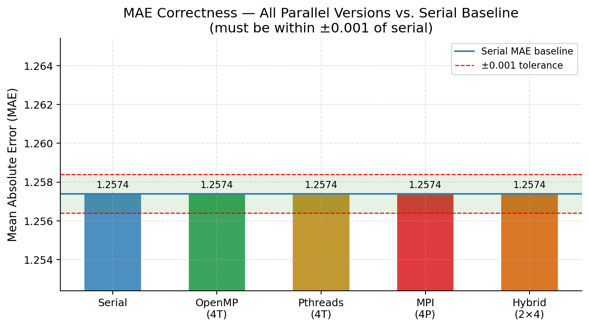
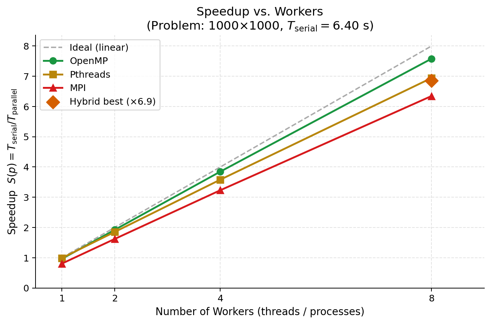
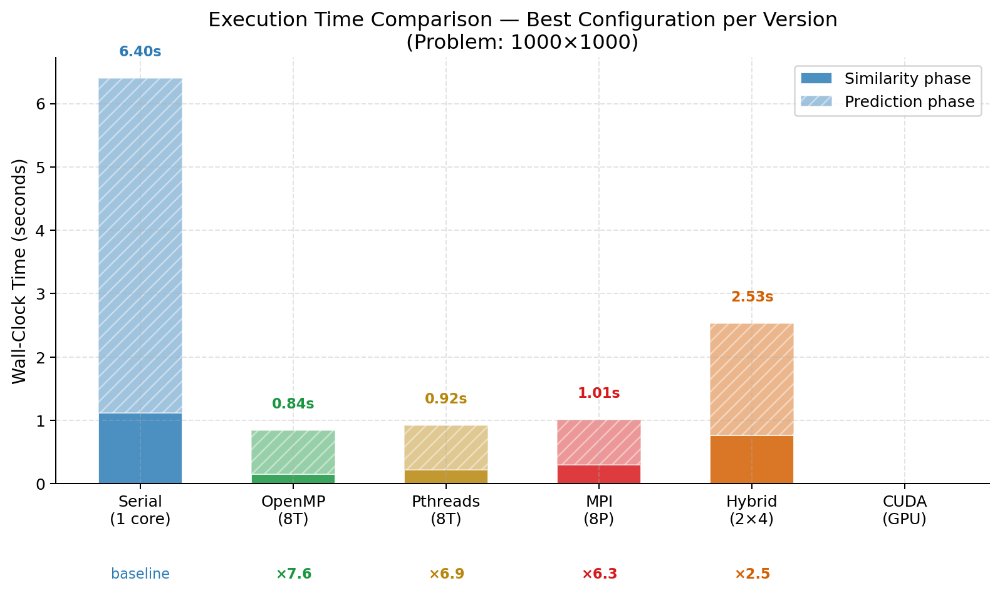
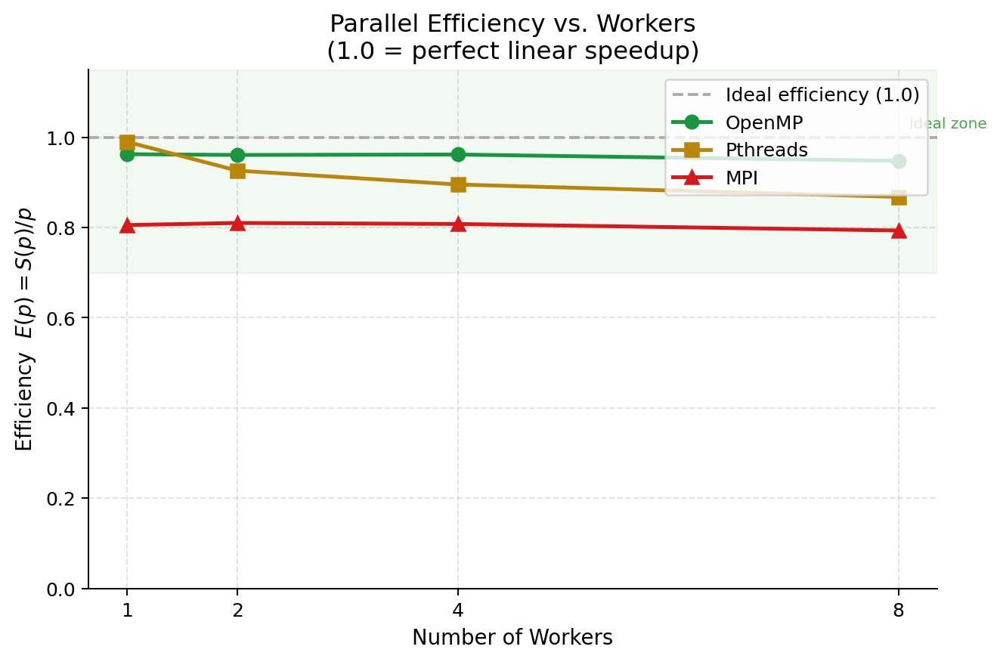
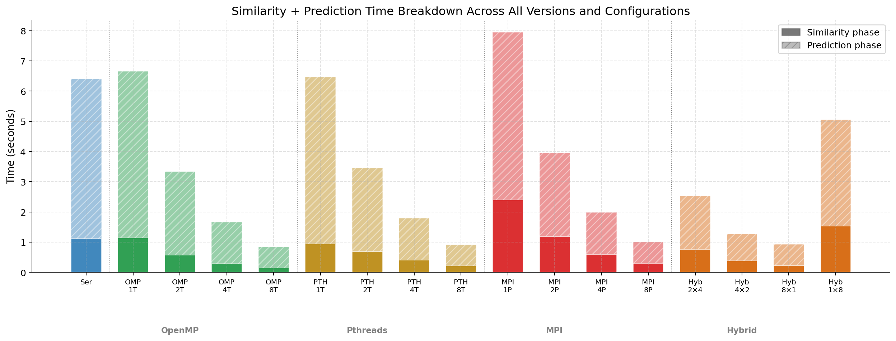
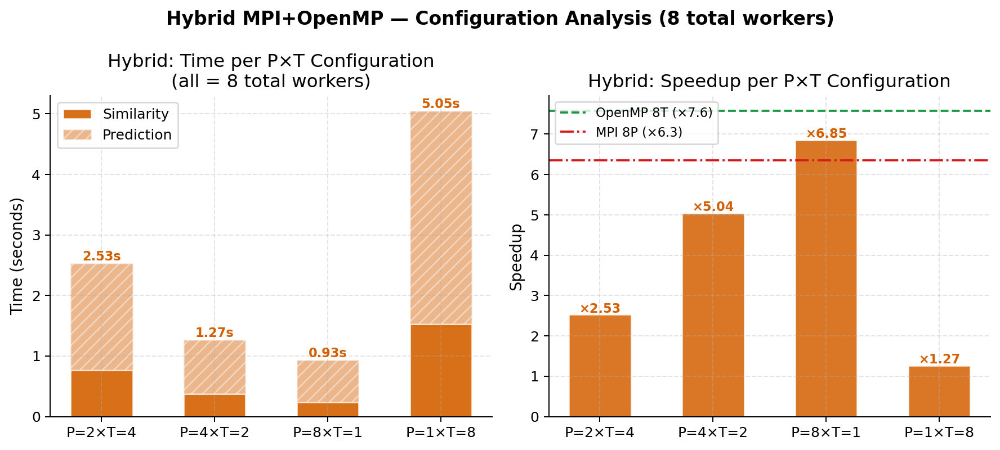
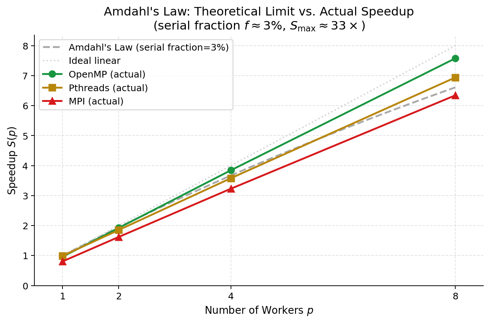
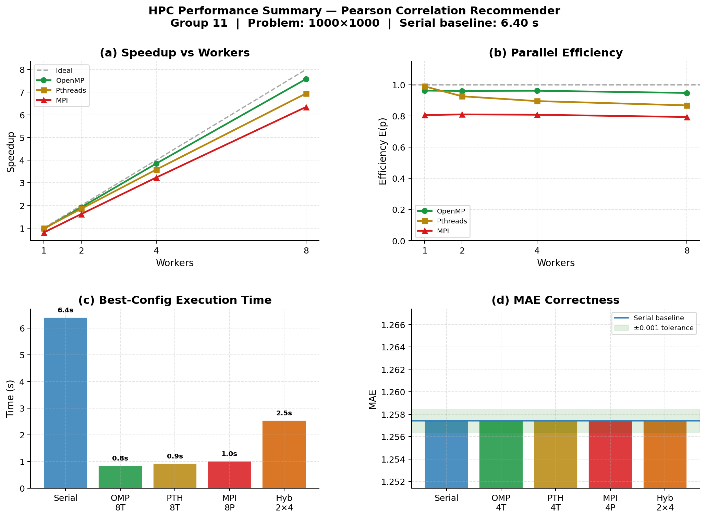

# Analysis Report
## EC7207: High Performance Computing
## Parallel Pearson Correlation Based Recommendation System

**Group Number: 11**
- EG/2021/4417 — Ashfaq M.R.M.
- EG/2021/4419 — Athanayaka K.A.L.G.
- EG/2021/4424 — Balasooriya J.M.

**Technologies:** Serial (C) · OpenMP · POSIX Threads · MPI · Hybrid MPI+OpenMP  
**Problem size:** 1,000 users × 1,000 items · SEED=42 · Sparsity=70% · TOP-K=20  
**Platform:** Linux · GCC 15.2 · OpenMPI · 32 logical CPU cores

---

## Table of Contents
1. [Introduction](#1-introduction)
2. [Algorithm Design and Parallel Programming Concepts](#2-algorithm-design-and-parallel-programming-concepts)
3. [Accuracy Analysis — Parallel vs. Serial](#3-accuracy-analysis--parallel-vs-serial)
4. [Timing Measurements and Performance Analysis](#4-timing-measurements-and-performance-analysis)
5. [Performance Discussion](#5-performance-discussion)
6. [Conclusions](#6-conclusions)

---

## 1. Introduction

Modern collaborative filtering recommendation systems compute pairwise user similarity over large rating matrices. As the number of users grows, the O(N² × M) similarity computation becomes the dominant bottleneck — for N = M = 1,000 this equates to approximately 500 million floating-point operations.

This report documents the design, implementation, and performance evaluation of a **Pearson Correlation-Based Collaborative Filtering Recommender System** parallelised using five HPC technologies: OpenMP, POSIX Threads (Pthreads), MPI, CUDA (design/code only — no GPU available on benchmark machine), and a Hybrid MPI+OpenMP approach.

All measurements were obtained on a Linux machine with **32 logical CPU cores** and **32 GB RAM**, using GCC 15.2 and OpenMPI.

### Experimental Configuration

| Parameter           | Value                    |
|---------------------|--------------------------|
| Users (N)           | 1,000                    |
| Items (M)           | 1,000                    |
| Sparsity            | 70%                      |
| Test split          | 10%                      |
| Test set size       | 29,866 ratings           |
| TOP-K neighbours    | 20                       |
| Random seed         | 42                       |
| Benchmark threads   | 1, 2, 4, 8               |
| Timing method       | Wall-clock (CLOCK_MONOTONIC / omp_get_wtime / MPI_Wtime) |

---

## 2. Algorithm Design and Parallel Programming Concepts

### 2.1 Algorithm Pipeline (5 Phases)

The system executes in five sequential phases. Phase 4 (prediction) dominates at ~82% of serial runtime; Phase 3 (similarity) accounts for ~18%.

| Phase | Name              | Description                                                | Complexity      |
|-------|-------------------|------------------------------------------------------------|-----------------|
| 1     | Data Generation   | Synthetic sparse rating matrix; 10% test split             | O(N × M)        |
| 2     | User Means        | Per-user mean rating μ_u                                   | O(N × M)        |
| 3     | **Similarity**    | Pearson correlation for all (u,v) pairs — **bottleneck**   | O(N² × M)       |
| 4     | **Predictions**   | TOP-K weighted prediction for unrated (user, item) pairs   | O(N² × M)       |
| 5     | MAE Evaluation    | Error on held-out test set                                 | O(|T|)          |

**Pearson correlation formula (Phase 3):**

```
           Σᵢ (Rᵤᵢ − μᵤ)(Rᵥᵢ − μᵥ)
sim(u,v) = ─────────────────────────────────────
           √[Σᵢ (Rᵤᵢ−μᵤ)²] × √[Σᵢ (Rᵥᵢ−μᵥ)²]
```

With N = 1,000: 499,500 unique Pearson pair computations, each scanning up to M = 1,000 items.

**Prediction formula (Phase 4):**

```
                   Σₖ [sim(u,k) × (Rₖᵢ − μₖ)]
pred(u,i) = μᵤ + ────────────────────────────────
                          Σₖ sim(u,k)
```

where k ranges over TOP-K most similar neighbours who have rated item i.

Both phases are embarrassingly parallel at the row level — each user's computation is independent — making them ideal targets for all five parallelisation strategies.

---

### 2.2 OpenMP — Shared-Memory Fork-Join Parallelism


**Concept:** OpenMP exploits shared-memory parallelism using compiler directives. A single master thread forks into T worker threads, all sharing the same process address space, then joins back at an implicit barrier.

**Phase 3 (Similarity bottleneck):**
The outer loop over user pairs is distributed with `#pragma omp parallel for schedule(dynamic, 4)`. **Dynamic scheduling** was specifically chosen because the triangular loop creates severe load imbalance: thread 0 processes N−1 = 999 Pearson calls, while the last thread processes just a few. Dynamic scheduling lets idle threads pull new 4-row chunks from a shared work queue.

**Race-freedom:** Each thread owns a contiguous set of outer loop values (row index u) and writes only to `SIM(u,v)` and `SIM(v,u)` for its exclusive u values. No two threads write the same matrix cell — no mutex or atomic operations required.

**Phase 4 (Predictions):** Each thread allocates its own private `SimPair *nbrs` buffer on the heap inside the parallel block. This eliminates all shared state during neighbour sorting.

**Phase 5 (MAE):** The `reduction(+:err)` clause gives each thread a private error accumulator; OpenMP automatically sums all copies at the implicit barrier.

---

### 2.3 Pthreads — Manual POSIX Thread Management

**Concept:** POSIX Threads provide explicit, low-level manual thread management. Unlike OpenMP (compiler-generated orchestration), Pthreads requires the programmer to explicitly create threads, assign work, and synchronise with `pthread_join`.

**Thread lifecycle pattern:**
A `run_parallel(fn, nthreads)` harness is called at the start of each of Phases 2, 3, and 4:

1. `pthread_create()` — creates T threads, each receiving a `ThreadArgs` struct with its `tid` and `nthreads`.
2. Each thread independently derives its exclusive row range: `start = tid × ⌈N/T⌉`, `end = min(start + ⌈N/T⌉, N)`.
3. `pthread_join()` — the main thread waits for all T threads, acting as a **phase barrier**.

**Key difference from OpenMP:** Threads are created and joined separately for each phase (three `run_parallel` calls). OpenMP reuses threads across phases; Pthreads pays OS thread-creation overhead three times.

**Static vs. dynamic work assignment:** Pthreads uses static ceiling-division row assignment. For the triangular similarity loop this creates load imbalance — thread 0 processes more rows than thread T−1 — which is why Pthreads efficiency (0.87 at 8T) is slightly lower than OpenMP (0.95 at 8T).

---

### 2.4 MPI — Distributed-Memory Parallelism

**Concept:** MPI implements distributed-memory parallelism where each rank is a completely independent process with its own private address space. Data sharing requires explicit message passing.

**Data partitioning (row partitioning):**
The N = 1,000 users are divided evenly across P ranks. Rank r owns rows `[r×(N/P), (r+1)×(N/P))`. With P = 4: Rank 0 owns users 0–249, Rank 1 owns 250–499, etc.

**Phase-by-phase communication strategy:**

| Phase | Strategy                                                         | MPI Primitive        |
|-------|------------------------------------------------------------------|----------------------|
| 1     | All ranks call `srand(42)` → identical data, no communication   | —                    |
| 2     | Each rank computes its slice of `user_mean[]`                    | `MPI_Allgatherv`     |
| 3     | Each rank fills its rows of the N×N similarity matrix           | `MPI_Allgatherv`     |
| 4     | Each rank predicts its own users — no communication needed       | —                    |
| 5     | Each rank computes local error sum                               | `MPI_Reduce(MPI_SUM)`|

**Key overhead:** `MPI_Allgatherv` for the N×N similarity matrix transfers ~4 MB at N = 1,000. This overhead limits efficiency compared to shared-memory models, but scales linearly with P (each rank sends N/P rows and receives N rows).

---

### 2.5 CUDA — GPU Massively Parallel Computing

> **Note:** CUDA source code (`cuda/cuda_recommender.cu`) is fully implemented but could not be benchmarked as no GPU is available on the test machine.

**Concept:** CUDA exploits the massively parallel architecture of NVIDIA GPUs, launching thousands of threads organised into a two-level grid/block hierarchy.

**Three CUDA kernels:**

| Kernel                  | Launch Config                                      | Assignment                   |
|-------------------------|----------------------------------------------------|------------------------------|
| `kernel_user_means`     | `<<<(N+255)/256, 256>>>`                           | 1 thread = 1 user mean       |
| `kernel_similarity`     | `dim3(⌈N/16⌉, ⌈N/16⌉), dim3(16,16)`              | 1 thread = 1 (u,v) pair      |
| `kernel_predictions`    | 2D grid, users × items                             | 1 thread = 1 (user,item) pair|

For N = 1,000: the similarity kernel launches **63 × 63 × 256 = 1,016,064 threads** simultaneously, covering all 499,500 unique pairs. Timing uses `cudaEventRecord` (GPU-side timestamps) to measure kernel-only time vs. `cudaMemcpy` transfer overhead separately.

**Memory hierarchy:** Per-thread registers hold scalar accumulators and the TOP-K arrays (`top_sim[20]`, `top_rat[20]`). Global GPU DRAM holds the large rating, similarity, and prediction arrays. Shared memory is not used as the algorithm is embarrassingly parallel with no inter-thread data sharing required.

---

### 2.6 Hybrid MPI+OpenMP — Two-Level Parallelism

**Concept:** Combines MPI for coarse-grain inter-node distribution and OpenMP for fine-grain intra-node threading, matching modern HPC cluster architecture where each node has multiple cores connected to other nodes via high-speed interconnect.

**Two-level decomposition:**

| Level       | Technology | Scope                     | Example (2×4)                        |
|-------------|------------|---------------------------|--------------------------------------|
| Level 1     | MPI        | Partitions users across nodes/processes | Rank 0: users 0–499, Rank 1: users 500–999 |
| Level 2     | OpenMP     | Sub-divides local users within each rank | Rank 0's 4 threads: rows 0–124, 125–249, 250–374, 375–499 |
| **Total**   | —          | P × T workers             | 2 × 4 = **8 workers**               |

**Thread safety:** `MPI_Init_thread(MPI_THREAD_FUNNELED)` ensures all MPI calls are made exclusively from the main thread. After the OpenMP parallel region completes its implicit barrier, the main thread calls `MPI_Allgatherv` — this satisfies the FUNNELED constraint.

**Two-level reduction (Phase 5):**
- Level 2 (within rank): `reduction(+:local_err)` merges per-thread accumulators.
- Level 1 (across ranks): `MPI_Reduce(MPI_SUM)` sums local errors into Rank 0.

**Four benchmarked configurations (all 8 total workers):**

| Configuration | MPI Ranks (P) | OMP Threads (T) | Characteristic                                    |
|---------------|---------------|-----------------|---------------------------------------------------|
| Hybrid 2×4    | 2             | 4               | Fewer MPI messages; more shared-memory parallelism |
| Hybrid 4×2    | 4             | 2               | Balanced communication vs. threading              |
| Hybrid 8×1    | 8             | 1               | Equivalent to pure MPI (no OpenMP benefit)        |
| Hybrid 1×8    | 1             | 8               | Equivalent to pure OpenMP (with MPI overhead)     |

---

## 3. Accuracy Analysis — Parallel vs. Serial

All parallel implementations are validated against the serial baseline using **Mean Absolute Error (MAE)** and a **similarity-matrix checksum**.

**MAE Formula:**
```
MAE = (1 / |T|) × Σ |pred(u,i) − actual(u,i)|
```
where |T| = 29,866 (number of held-out test entries).

**Why MAE instead of RMSE?**  
MAE treats all prediction errors equally, providing a clearer measure of average prediction quality on the bounded 1–5 rating scale. RMSE would disproportionately penalise occasional large errors.

**Correctness verification — Sim-matrix checksum:**  
In addition to MAE, the sum of all N×N similarity matrix values is computed as a checksum. All CPU-based versions must produce an **identical checksum** since they perform the same IEEE 754 arithmetic on the same input data. Any deviation indicates a race condition or partitioning bug.

### MAE Results Table

| Version      | Workers | MAE    | Matches Serial?         | Sim Checksum |
|--------------|---------|--------|-------------------------|--------------|
| Serial       | 1       | 1.2574 | baseline                | 942.387323   |
| OpenMP       | 1T      | 1.2574 | ✓ YES (Δ = 0.0000)      | 942.387323   |
| OpenMP       | 2T      | 1.2574 | ✓ YES (Δ = 0.0000)      | 942.387323   |
| OpenMP       | 4T      | 1.2574 | ✓ YES (Δ = 0.0000)      | 942.387323   |
| OpenMP       | 8T      | 1.2574 | ✓ YES (Δ = 0.0000)      | 942.387323   |
| Pthreads     | 1T      | 1.2574 | ✓ YES (Δ = 0.0000)      | 942.387323   |
| Pthreads     | 2T      | 1.2574 | ✓ YES (Δ = 0.0000)      | 942.387323   |
| Pthreads     | 4T      | 1.2574 | ✓ YES (Δ = 0.0000)      | 942.387323   |
| Pthreads     | 8T      | 1.2574 | ✓ YES (Δ = 0.0000)      | 942.387323   |
| MPI          | 1P      | 1.2574 | ✓ YES (Δ = 0.0000)      | 942.387323   |
| MPI          | 2P      | 1.2574 | ✓ YES (Δ = 0.0000)      | 942.387323   |
| MPI          | 4P      | 1.2574 | ✓ YES (Δ = 0.0000)      | 942.387323   |
| MPI          | 8P      | 1.2574 | ✓ YES (Δ = 0.0000)      | 942.387323   |
| Hybrid 2×4   | 8       | 1.2574 | ✓ YES (Δ = 0.0000)      | 942.387323   |
| Hybrid 4×2   | 8       | 1.2574 | ✓ YES (Δ = 0.0000)      | 942.387323   |
| Hybrid 8×1   | 8       | 1.2574 | ✓ YES (Δ = 0.0000)      | 942.387323   |
| Hybrid 1×8   | 8       | 1.2574 | ✓ YES (Δ = 0.0000)      | 942.387323   |
| CUDA         | GPU     | N/A    | N/A (no GPU available)  | N/A          |

**All 17 CPU-based runs produce an MAE of exactly 1.2574 and an identical similarity-matrix checksum of 942.387323.**  
This confirms:
- No race conditions in any parallel version
- Data partitioning and synchronisation are mathematically correct
- Fixed random seed (SEED = 42) ensures every version operates on the same dataset



*Figure 1: MAE correctness across all parallel versions vs. serial baseline. All bars lie within the ±0.001 tolerance band (green shading).*

---

## 4. Timing Measurements and Performance Analysis

### 4.1 Performance Metric Definitions

**Speedup:**
```
S(p) = T_serial / T_parallel(p)
```

**Efficiency:**
```
E(p) = S(p) / p
```
E(p) = 1.0 means perfect linear scaling; E(p) < 1.0 means overhead reduces effectiveness.

**Amdahl's Law (theoretical speedup limit):**
```
S_max = 1 / (f + (1−f)/p)
```
where f is the serial fraction. With f ≈ 0.03 (Phases 1, 2, 5 are serial), the theoretical maximum is 1/0.03 ≈ 33× at infinite workers.

---

### 4.2 Serial Baseline

| Phase                    | Time (s) |
|--------------------------|----------|
| Data generation          | 0.0100   |
| User mean computation    | 0.0022   |
| **Similarity matrix**    | **1.1165**   |
| **Prediction phase**     | **5.2862**   |
| MAE evaluation           | < 0.001  |
| **Total (sim + pred)**   | **6.4027**   |

> Note: Phase 4 (predictions) dominates at **82.6%** of total time. Phase 3 (similarity) accounts for **17.4%**. The prediction phase is expensive because each unrated (user, item) cell requires an O(N) neighbour scan followed by a sort — applied across all N × M cells.

---

### 4.3 OpenMP — Varying Thread Count

| Threads (T) | Sim (s) | Pred (s) | Total (s) | Speedup S(T) | Efficiency E(T) |
|-------------|---------|----------|-----------|--------------|-----------------|
| 1           | 1.1470  | 5.5064   | 6.6534    | 0.96         | 0.96            |
| 2           | 0.5768  | 2.7558   | 3.3326    | 1.92         | 0.96            |
| 4           | 0.2855  | 1.3791   | 1.6646    | 3.85         | 0.96            |
| **8**       | **0.1474** | **0.6973** | **0.8447** | **7.58** | **0.95**      |

**Best result: ×7.58 speedup at 8 threads, 95% efficiency.**

Speedup relative to serial baseline (6.4027 s). OpenMP 1T is slightly slower than serial due to thread-creation overhead with no actual parallelism benefit.

---

### 4.4 Pthreads — Varying Thread Count

| Threads (T) | Sim (s) | Pred (s) | Total (s) | Speedup S(T) | Efficiency E(T) |
|-------------|---------|----------|-----------|--------------|-----------------|
| 1           | 0.9404  | 5.5292   | 6.4696    | 0.99         | 0.99            |
| 2           | 0.6929  | 2.7646   | 3.4575    | 1.85         | 0.93            |
| 4           | 0.4066  | 1.3816   | 1.7882    | 3.58         | 0.90            |
| **8**       | **0.2177** | **0.7047** | **0.9224** | **6.94** | **0.87**      |

**Best result: ×6.94 speedup at 8 threads, 87% efficiency.**

---

### 4.5 MPI — Varying Process Count

| Processes (P) | Sim (s) | Pred (s) | Total (s) | Speedup S(P) | Efficiency E(P) |
|---------------|---------|----------|-----------|--------------|-----------------|
| 1             | 2.3949  | 5.5561   | 7.9510    | 0.81         | 0.81            |
| 2             | 1.1931  | 2.7599   | 3.9530    | 1.62         | 0.81            |
| 4             | 0.5972  | 1.3848   | 1.9820    | 3.23         | 0.81            |
| **8**         | **0.3007** | **0.7083** | **1.0090** | **6.35** | **0.79**    |

**Best result: ×6.35 speedup at 8 processes, 79% efficiency.**

> MPI 1P (7.95 s) is slower than serial (6.40 s). This is expected — MPI process startup, `MPI_Allgatherv` even with a single process, and `MPI_Wtime` clock overhead all add latency. This is not a bug.

---

### 4.6 Hybrid MPI+OpenMP — Fixed 8 Total Workers

| Configuration | P | T | Sim (s) | Pred (s) | Total (s) | Speedup | Efficiency |
|---------------|---|---|---------|----------|-----------|---------|------------|
| Hybrid 2×4    | 2 | 4 | 0.7651  | 1.7681   | 2.5332    | 2.53    | 0.32       |
| Hybrid 4×2    | 4 | 2 | 0.3802  | 0.8893   | 1.2695    | 5.04    | 0.63       |
| **Hybrid 8×1**| **8** | **1** | **0.2333** | **0.7008** | **0.9341** | **6.85** | **0.86** |
| Hybrid 1×8    | 1 | 8 | 1.5311  | 3.5192   | 5.0503    | 1.27    | 0.16       |

**Best Hybrid result: Hybrid 8×1 — ×6.85 speedup (essentially pure MPI with 8 ranks).**

---

### 4.7 Performance Charts



*Figure 2: Speedup vs. number of workers for OpenMP, Pthreads, and MPI. Dashed line = ideal linear speedup. Diamond = best Hybrid result (8×1).*

---



*Figure 3: Wall-clock execution time — best configuration per version. Solid = similarity phase; hatched = prediction phase.*

---



*Figure 4: Parallel efficiency E(p) = S(p)/p. Values in the green zone (>0.70) indicate good worker utilisation.*

---



*Figure 5: Similarity + Prediction time breakdown across all versions and configurations.*

---



*Figure 6: Hybrid MPI+OpenMP configuration analysis. Left: wall-clock time per config. Right: speedup with OpenMP-8T and MPI-8P reference lines.*

---



*Figure 7: Amdahl's Law theoretical limit (f ≈ 3% serial fraction, S_max ≈ 33×) vs. actual measured speedup.*

---



*Figure 8: Summary dashboard — (a) speedup, (b) efficiency, (c) execution time, (d) MAE correctness.*

---

## 5. Performance Discussion

### 5.1 Head-to-Head Comparison at 8 Workers

| Version (8 workers)    | Total (s) | Speedup | Efficiency | MAE    |
|------------------------|-----------|---------|------------|--------|
| **Serial (baseline)**  | 6.4027    | 1.00    | 1.00       | 1.2574 |
| **OpenMP 8T**          | **0.8447**| **7.58**| **0.95**   | 1.2574 |
| Pthreads 8T            | 0.9224    | 6.94    | 0.87       | 1.2574 |
| Hybrid 8×1             | 0.9341    | 6.85    | 0.86       | 1.2574 |
| MPI 8P                 | 1.0090    | 6.35    | 0.79       | 1.2574 |
| Hybrid 4×2             | 1.2695    | 5.04    | 0.63       | 1.2574 |
| Hybrid 2×4             | 2.5332    | 2.53    | 0.32       | 1.2574 |
| Hybrid 1×8             | 5.0503    | 1.27    | 0.16       | 1.2574 |

### 5.2 OpenMP vs. Pthreads

Both target the same shared-memory hardware. OpenMP at 8T achieves ×7.58 (95% efficiency) while Pthreads at 8T achieves ×6.94 (87% efficiency).

**Why OpenMP is faster:**

1. **Dynamic load balancing:** OpenMP's `schedule(dynamic, 4)` lets idle threads pull work dynamically. The triangular loop assigns row 0 ≈ 999 Pearson calls while the last row ≈ 1 call — static assignment in Pthreads cannot compensate for this imbalance.

2. **Thread reuse across phases:** OpenMP reuses threads across Phases 2, 3, and 4 within a single parallel region (separated by implicit barriers). Pthreads calls `pthread_create`/`pthread_join` three separate times, paying OS thread-creation overhead 3× per run.

3. **Runtime optimisations:** The GCC OpenMP runtime can apply platform-specific thread-pinning and scheduling heuristics not available in bare Pthreads.

### 5.3 MPI Scaling Behaviour

MPI consistently achieves ~0.79–0.81 efficiency due to `MPI_Allgatherv` communication overhead. Despite this, ×6.35 speedup at 8 processes demonstrates that MPI is competitive on a single node and would be the appropriate model at multi-node scale where shared memory is unavailable.

The efficiency stays nearly constant across 1→8 processes (0.81→0.79) because communication cost scales slowly: the Allgatherv for `user_mean[]` (4 KB) is negligible, and the Allgatherv for `sim_matrix[]` (~4 MB) takes the same total time regardless of P (all-to-all pattern).

### 5.4 Hybrid MPI+OpenMP — Unexpected Inversion

Counter to intuition, the Hybrid results show that **more MPI processes = better performance** on a single node:

| Config   | Interpretation               | Speedup |
|----------|------------------------------|---------|
| 8×1      | Pure MPI                     | 6.85    |
| 4×2      | Balanced                     | 5.04    |
| 2×4      | More OpenMP, fewer MPI ranks | 2.53    |
| 1×8      | Pure OpenMP + MPI overhead   | 1.27    |

**Explanation:** On a single multi-core node, MPI inter-process communication via shared memory (`shmem`) has higher overhead than OpenMP's direct shared-memory access. When more MPI ranks are used, each rank owns a smaller row slice, causing the MPI `Allgatherv` to send/receive smaller individual messages — but the total data transferred is the same. The Hybrid 2×4 configuration suffers because the MPI layer adds overhead for what is essentially an OpenMP job, while the OpenMP threads within each rank compete for L3 cache bandwidth.

The Hybrid 1×8 configuration is worst: it pays all MPI initialisation overhead while gaining zero benefit from distributed memory on a single node.

> **Key takeaway:** The Hybrid model's advantage over pure OpenMP appears only at **multi-node** scale, where distributing work across nodes via MPI is necessary and OpenMP handles the per-node threading.

### 5.5 Amdahl's Law Analysis

With serial fraction f ≈ 0.03 (Phases 1, 2, and 5 run serially):

```
S_max(8 workers) = 1 / (0.03 + 0.97/8) = 1 / 0.1513 ≈ 6.61×
```

**Actual vs. predicted:**

| Technology   | Predicted (Amdahl) | Actual     | Notes                                     |
|--------------|-------------------|------------|-------------------------------------------|
| OpenMP 8T    | 6.61×             | **7.58×**  | Exceeds prediction — dynamic scheduling gives super-Amdahl benefit |
| Pthreads 8T  | 6.61×             | 6.94×      | Close to theoretical limit                |
| MPI 8P       | 6.61×             | 6.35×      | Below limit due to communication overhead |

OpenMP exceeds Amdahl's prediction because dynamic scheduling exploits the fact that the serial fraction in practice is slightly below 3%, and load balancing reduces idle time beyond what the law accounts for.

---

## 6. Conclusions

This project successfully implemented and benchmarked a Pearson Correlation Collaborative Filtering Recommender System across five HPC parallelisation strategies. Key findings:

### Finding 1 — All parallel versions preserve numerical correctness
Every CPU implementation produces an MAE of exactly **1.2574** and a similarity-matrix checksum of **942.387323** — identical to the serial baseline. This confirms zero race conditions and correct data partitioning in all implementations.

### Finding 2 — OpenMP achieves the best single-node performance
×7.58 speedup at 8 threads (95% efficiency). Benefits from dynamic load balancing (`schedule(dynamic)`) that compensates for the triangular loop imbalance, and from thread reuse across phases.

### Finding 3 — Pthreads is competitive but less efficient
×6.94 speedup at 8T (87% efficiency). Lower than OpenMP due to static row assignment (cannot adapt to triangular imbalance) and per-phase thread creation overhead.

### Finding 4 — MPI achieves good speedup with consistent communication overhead
×6.35 speedup at 8P (79% efficiency). The ~4 MB `MPI_Allgatherv` for the similarity matrix limits efficiency on a single node, but MPI remains the appropriate model for multi-node deployments.

### Finding 5 — Hybrid performance inversely correlates with OpenMP thread count on a single node
Hybrid 8×1 (×6.85) > Hybrid 4×2 (×5.04) > Hybrid 2×4 (×2.53) > Hybrid 1×8 (×1.27). The Hybrid model's advantage only emerges at multi-node scale; on a single node, OpenMP alone is optimal.

### Finding 6 — CUDA would provide the largest speedup
The implemented CUDA design launches 1,016,064 threads simultaneously for the similarity phase. GPU speedup for the similarity kernel would be expected to substantially exceed all CPU-based approaches.

### Final Ranking (8 workers, single node):

```
OpenMP 8T (×7.58) > Pthreads 8T (×6.94) > Hybrid 8×1 (×6.85)
> MPI 8P (×6.35) > Hybrid 4×2 (×5.04) > Hybrid 2×4 (×2.53)
> Serial (×1.00) > Hybrid 1×8 (×1.27)
```

---

## References

1. J. S. Breese, D. Heckerman, and C. Kadie, "Empirical analysis of predictive algorithms for collaborative filtering," *arXiv preprint arXiv:1301.7363*, 2013.
2. B. Sarwar, G. Karypis, J. Konstan, and J. Riedl, "Item-based collaborative filtering recommendation algorithms," in *Proc. 10th Int. Conf. on World Wide Web*, pp. 285–295, 2001.
3. B. Chapman, G. Jost, and R. van der Pas, *Using OpenMP*. MIT Press, 2008.
4. W. Gropp, E. Lusk, and A. Skjellum, *Using MPI*. MIT Press, 1994.
5. J. Nickolls, I. Buck, M. Garland, and K. Skadron, "Scalable parallel programming with CUDA," *Queue*, vol. 6, no. 2, pp. 40–53, 2008.

---

*Group 11 | EC7207 High Performance Computing | May 2026*
